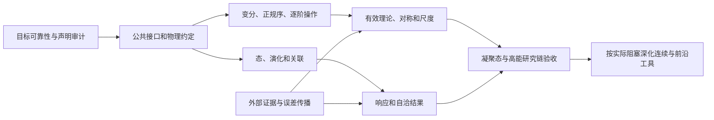

# LeanPhy 全局建设路线

**2026-10-08 更新：** 当前新增范围的组件检查及剩余回归已分段通过，单次完整发布运行尚无成功终态；见 [VERIFIED](../VERIFIED.md)。R07 已补实际 Euler／变分流与正则域，R11 已补有理 Gibbs 数值证书，R05 已补实际真空任意点数与表达式读数，本批 R08 补混合二次传播重场的有限展开、源／读数及实际区间作用量匹配；随后已推进 R06 的一般时变驱动。

规划基于 [28 项能力盘点](capabilities.md)，以当前 `Lean_PHY` 工作树为准，最近复核于 2026-10-08。先复核全局功能、缺口、依赖和验收标准，再按所选范围实施。本文按共同模型、凝聚态、高能／场论、受控近似及探索工作流五个建设面安排任务；专题实现和验证证据分别见专题指南与根目录 `VERIFIED.md`。

## 1. 产品目标与当前定位

目标是成为凝聚态、高能及相关理论研究中可实际使用的形式化验证工具：研究者给出候选模型、约定和待验证步骤，系统帮助完成形式操作、定位所需前提、检查推导并保留开放任务；在有额外证据时，进一步产生可观测量的受控近似结论。

当前已有较广的有限对象、代数和证书基础，以及可工作的 Lie 计算与审计流程。主要问题是研究链之间的连接、常用操作的通用性，以及部分物理解释／账本状态的可靠性。近期目标是连通这些基础，不以扩充文件数、领域别名或固定案例数量作为完成标准。

全局盘点后，已接入目标绑定与证明历史、独立公共核心、真实声明检索，以及一阶耦合作用量到方程、局部流和残差预算的公共链。有限作用量／系综、源导数、量子热态及静态读数已连接；有限费米构造、实际量子响应和条件分支也已接入。逐阶／消元与残差证书已连接到物理有效读数；实际场与区间作用量补上变分的解析解释；任意费米表达式及局部嵌入补上相互作用模型的公共输入。各功能的输入、条件和源码见[能力清单](capabilities.md)；以下按整个研究过程决定后续建设。

### 当前能力对应的建设决策

| 决策 | 对应能力 | 后续处理 |
| --- | --- | --- |
| 复用已有公共基础 | 有限态／酉演化、有限 Gibbs、参数模型、量纲与张量、一阶局部变分、误差传播、工作流与审计 | 补相邻操作所需适配器，并保持已验证行为。 |
| 将局部实现推广为公共操作 | 玻色／混合分级算符、实际态收缩、能带几何、物理表述转换 | 先规定可变输入与保持关系，再推广维度、模型内容或阶数。 |
| 补通尚未完成的主要推导链 | 多维边界／场替换、真实态多点关联、一般驱动／频率响应、受控低能约化与传播重场匹配；扩展已有有限矩阵证据到读数误差的链 | 作为下一阶段的主要功能交付，复用共同对象、操作和证据层。 |
| 让条件性接口获得实际输入 | 压缩性、谱隙、稳定性、残差、可积性与极限控制 | 围绕所选研究链，从更基本且可核验的条件导出所需证书。 |
| 按物理需求深化专题 | 更高阶 Lie／ghost、无限维分析、BV、非平衡、拓扑与圈计算 | 先说明被阻塞的物理步骤，再决定需要增加的专题功能。 |

以上决策面向整个项目。具体实现批次可以只解决其中一部分，但进度报告需要同时说明其它主线的状态，保留全局范围。

### 接下来建设什么，以及为什么

按五个建设面组织近期工作。它们是产品范围，不是五个必须串行完成的大工程；其中公共约定、证据与探索工作流随所服务的物理链一同交付。

| 建设面 | 当前可复用基础 | 优先补的功能 | 本阶段的可用性出口 |
| --- | --- | --- | --- |
| 共同模型与物理语义 | 有限态、指标、量纲、参数模型、公共操作和审计 | 统一必要的输入转换；核对时间／源／伴随约定；将正在开发的功能单独验收 | 新模型可接到已有操作；模型、表述及前提变更不会沿用不适用的结论。 |
| 凝聚态研究链 | 任意模式 CAR 与二次多体 Hamiltonian、有限热态、有限时间 Kubo／非对易 Gibbs、谱与精确分块 | 高效相互作用操作与玻色截断；真实态多点、一般驱动／频率响应；受控低能读数与自洽条件 | 从可更换的耦合／探针输入，得到关联、响应或有效模型结论，并显式给出适用域。 |
| 高能／场论研究链 | 局部变分、实际场求值、区间作用量与流平衡、逐阶／辅助场消元、gamma／Fierz／ghost | 多维边界与区域解释；场替换及 IBP/EOM；传播重场匹配；协变／分级物理对象 | 从可更换的场内容／耦合，得到方程、算符关系或匹配结果，同时跟踪源、阶数及边界前提。 |
| 受控近似与外部计算 | 残差传播、固定点、Lie 精确核验；新增有理复矩阵残差到谱域和消元误差 | 自动可靠包络、区间／多项式证书、自洽与谱读数、稀疏规模化 | 外部候选经 Lean 核验产生实际模型结论，适用域与误差来源明确。 |
| 探索工作流 | 原目标绑定、假设分支、反例／失败记录、覆盖合并、版本历史和显式修订复用 | 条件语义检索、自动依赖影响分析、跨项目协作 | 同一研究问题可保留多个方案；条件性结果只有经域消除或覆盖证明才能关闭原目标。 |

优先级依据是：先修复会误导研究结论的问题，再补多个任务反复需要的操作与连接，随后证明适用域与误差，最后按实际需求深化专题。已有工作量或模块数量不构成优先理由。费米构造服务凝聚态链，不是推进高能作用量链的统一前置条件；探索工作流也不等待所有物理功能完成。

## 2. 系统按研究操作组织

| 层 | 研究者提供什么 | 系统应产生什么 | 主要复用基础 |
| --- | --- | --- | --- |
| 物理描述 | 自由度、Hamiltonian／作用量、态、参数域、对称与约定 | 可被后续操作共同消费的模型；必要的表述转换证明 | 量纲／张量、有限态、参数模型、谱与格点对象 |
| 推导操作 | 模型及某项操作所需前提 | 变分、对易、正规序、收缩、展开、消元等结果及适用条件 | 多项式导子、CCR/CAR、有限和、生成器与 tactic |
| 物理结果 | 态、演化、源、有效自由度或对称变换 | 方程、守恒流、关联／响应、有效算符及匹配关系 | 有限演化、路径和、约束、谱、已有 Lie／ghost 工具 |
| 近似与证据 | 截断阶数、残差、稳定性／谱隙、外部候选数据 | 分来源的误差预算、可观测量界、可消费的极限条件 | ErrorCertificate、模型近似、固定点、算符收敛、精确证书核验 |
| 研究工作流 | 猜想、假设分支、部分证明与数据来源 | 可发现的定理、待解 Lean 目标、可靠状态与可重复报告 | Workflow、CLI、Scaffold、Verification 与项目审计 |

这是一种职责划分，不要求先造一个包容所有物理的总结构。静态系综、作用量和连续演化可以保持各自合适的类型，通过明确映射互接。公共工作流不应依赖全部内置物理实例。

每条推导应明确属于以下哪一种结果：精确恒等式；形式上相等到某阶；带范数／概率误差界的结论；条件尚未满足的候选命题。形式阶数不自动蕴含收敛、数值误差界或物理有效性。

## 3. 七条全局建设主线

P0 是必须先处理的正确性或集成问题；P1 是近期直接改善研究能力的工作；P2 是在实际研究链需要时推进的深化。优先级按依赖调整，不按某个专题已经写了多少代码调整。

| 主线 | 能力编号／优先级 | 已有基础 | 需要交付的通用功能 | 验收方式 |
| --- | --- | --- | --- | --- |
| T0 可靠的推导与义务状态 | C04、C10、C24、C27；P0 | 带证明结论、完整声明与下游审计 | 已修复原始目标绑定、同名关闭与历史保留，以及耦合总导数；继续审查已知物理对象／注释不匹配 | 无关证明、同名换目标不能关闭原义务；混合动能产生所有分量的导数；审计能力保持 |
| T1 模型、约定与表述互接 | C01–C08、C28；P0/P1 | 参数模型、态、谱、有限 Fourier、量纲和指标 | 模型—态—算符—读数适配；基底／模式排序、伴随／反幺正、时空与源约定；多站点／多轨道构造 | 同一模型换表述后传输方程或可观测量；改变模式数与参数仍复用主要证明 |
| T2 可组合的形式操作 | C09–C12、C14–C16、C18；P1 | 导子、CCR/CAR、Wick 递归、有限和与 ghost | 一阶局部耦合变分与边界流已接入；新增实际场与区间积分，非交换逐阶操作已接入；任意费米词正规序已接入；继续玻色／混合分级操作与真实态收缩、变量替换、IBP/EOM 操作 | 输入新系数／场内容／阶数仍可用；错误符号、次序、漏项与缺失边界前提有负向回归 |
| T3 关联、Green 函数与响应 | C05、C06、C08、C12、C13、C15；P1，深入非平衡为 P2 | 有限态与演化、Gibbs、连通二点、迹对易子 | 有限源／温度导数、静态涨落和量子热态桥已接入；新增实际时间导数、有限时间 Kubo、非对易 Gibbs 导数和有限采样 Fourier 重构；新增有限权重对称到 Ward 插入的桥；继续一般驱动、时间有序多点／连续频率表示和局部／量子自洽；有限实源闭环已接入 | 从实际态／Hamiltonian 推出响应；显式保留 β、接触项、非对易修正、采样归一化和适用参数域；有限 Ward 桥必须保留变换和权重对称前提 |
| T4 有效理论、规范与尺度 | C06、C11、C14–C18、C28；P1/P2 | 幂计数尾界、约束映射、Lie/BRST 计算、有限 blocking | 精确分块／辅助场消元和有效读数已接入；新增有限谱域与逆误差、有限 RG 缺陷到读数预算；已接二次传播重场的有限阶／区间匹配；继续更广低能域、酉约化、Green 函数、量子匹配、场重定义与算符基转换；把对称约束接到作用量／振幅；再发展受控 RG | 凝聚态与高能共用展开／消元工具；除有效对象外还交付读数转换、阶数、前提与未决任务；有限 blocking 不直接代表连续 beta 流 |
| T5 受控近似与外部证据 | C19–C23；P1，深入连续分析为 P2 | 误差传播、固定点、谱与极限接口、Lie 数据核验；新增有理复矩阵到实际逆及读数误差；新增有限 RG 缺陷的逐点、分阶段和归一化证书 | 继续可靠物理／舍入包络、区间／多项式证书和自洽认证；拆分微扰、体积、离散和数值误差；按需求补连续桥 | 外部候选经 Lean 核验得到实际模型结论；篡改数据被拒绝；关键误差界由较基本条件导出，分母下界和中间权重等式不能省略 |
| T6 人与 AI 的探索工作流 | C03、C24–C27；P0/P1 | Lean 目标、账本、模板、完整审计、分支与修订操作 | 公共分支和证据生命周期已接入物理客户端；继续适用域／约定语义检索、自动变更影响和跨项目依赖诊断 | 新研究项目能保留探索过程、复用部分证明并明确哪些前提仍需证明 |

数学基础的新增必须注明服务上述哪一步物理操作。现有分析、上同调及谱工具优先复用；只有真实模型需要的能力缺口才触发继续深化。

## 4. 建设阶段与依赖

| 阶段 | 建设范围 | 阶段出口 | 当前状态 |
| --- | --- | --- | --- |
| S0 全局基线 | 核对实现、接口、物理范围和项目版本；稳定能力编号与优先级 | 所有主要研究任务有源码依据、状态和缺口；事实与计划分开 | 已建立并复核 28 项清单；功能状态与验证基线随实现更新，完整记录见第 5 节 |
| S1 可靠且可发现的公共层 | T0；T6 核心拆分／索引；T1 已有模块互接所需约定 | 关闭任务绑定原目标；已知耦合算子缺陷修复；公共核心可独立导入；现有工具及完整审计兼容 | 首批已实现目标绑定、核心分离、声明索引及耦合算子修复；新增源符号、酉基底及 Nambu／多体转换；全局物理约定互接未完成 |
| S2 连通主要物理推导链 | T1/T2 支撑 T3/T4；T5 同步提供所需误差桥 | 凝聚态、高能各有可更换模型输入的完整链，共享公共操作；精确、逐阶与受控结果分明 | 局部作用量、有限态／响应、精确／形式消元与矩阵证书已有可用链；实际场与带边界区间作用量、任意费米相互作用表达式已完整验收；一般驱动、真实态关联、受控匹配和多维场论仍未完成 |
| S3 数值辅助与连续桥接 | T5 深化并消费 T3/T4 的结果 | 外部数据核验后得到物理读数界；至少一条连续／极限链的关键前提被实际满足，其余明确开放 | Lie 精确证书已有；新增有限复矩阵到实际谱域与消元误差的核验链；新增实际区间流预算；可靠包络、规模化与连续极限桥仍未完成 |
| S4 研究驱动的深化 | 更高阶 EFT/RG、非平衡、拓扑、多体谱、规范与选定圈计算 | 新功能解除实际研究阻塞，继承先前接口和验证；研究规模与性能有可重复证据 | 需求驱动，暂不承诺完整覆盖 |

图中是功能依赖，不是要求把所有基础全部做完才开始研究链。每个实施包同时交付最小公共操作和消费它的研究步骤；需要的分析前提同步进入工作流。

## 5. 近期实施队列

实施队列统一使用 R01–R14，分别标明当前基础、待补功能、依赖与验收出口。共同输入与约定由 R01/R02 维护；凝聚态的态／关联／响应由 R03–R06/R10 推进；高能的作用量／匹配／对称由 R07–R09 推进；R11/R12 随物理操作提供数值证据与探索记录。S2 的阶段出口需要同时评估凝聚态和高能的研究可用性。

移植或复用另一目录的代码时，逐项比较对象、导入、API、负向检查及审计范围，保留本仓库对私有声明、未导出模块和依赖产物的检查。通过验证后才更新当前能力状态。

### 全局待办与交付边界

这里跟踪当前验收基线与待开发功能，不能因为写入路线就提升能力状态。R 编号用于跟踪实施包，C 编号仍指[现有能力](capabilities.md)。每次选择一个可验收的批次，但选择前复核整张表。

| 待办／优先级 | 当前基础及缺口 | 下一步应交付的功能 | 依赖与验收出口 |
| --- | --- | --- | --- |
| R01 物理含义与约定审查，P0 | 量纲基础已有；复配对／Majorana／完整 Nambu 已接入；旧 Berry 等说明已校正，实际选带曲率与时间／单位转换仍缺 | 使对象说明与实际命题一致；提供单位／尺度恢复、复 Hermitian 配对、选定能带／投影及时间／源转换所需证明 | C01/C04/C07/C28；任意复配对与相反约定有回归，几何三重积不冒充已求得 Chern 数 |
| R02 新增功能验收，持续 P0 | 历史自洽范围已验收；当前点场替换、有限频率、真空收缩、传播重场匹配及有限格点出口完整验收待完成 | 持续保持入口／客户端、完整声明审计、指南和源／产物一致性记录 | C10/C14/C15/C27；每个新批次完整通过后才计入验收基线 |
| R03 可变多体模型构造，P1 | 有限占据构造与二次型已接入；新增任意有限费米相互作用表、系数解释、局部单射嵌入和实际热态 | 继续高效稀疏操作、模式／轨道换基的相互作用系数传输，以及大系统性能核验 | C02/C07/C09；新功能完整验收通过；符号 1024 标签测试不代表可展开相应占据矩阵 |
| R04 算符表达式与正规序，P1 | 新增任意长度费米词的终止正规化、严格排序／表示正确性、伴随与同类项合并；已接实际演化导数 | 继续玻色截断边界、混合分级对象、高效系数收集和规模性能；实际态收缩由 R05 承接 | C09；收缩常数、次序、Pauli、伴随及模式碰撞有拒绝检查；完整发布验证已通过 |
| R05 态到多点关联，P1 | 已有递归 kernel、实际态证书边界；新增任意有限模式空占据态构造，CAR 与消去条件推导任意长度线性探针矩、奇数矩和接触项；整数词矩接到符号相互作用读数；新增共同有限酉传输密度、生成元和有序矩 | **partial**：推广到明确 Gaussian／热态条件，再支持时间排序、源插入和动力学关联；补配对计算性能 | C05/C12/C15；已知真空消去条件由构造器证明；共同酉传输不等于热态或相互作用 Wick；一般态不能自动获得 Wick，接触项与 slot 反对称分开；本次验证见 VERIFIED 顶部 |
| R06 非对易静态与动力学响应，P1 | 实际 Duhamel、Heisenberg／态导数、非对易 Gibbs 导数、有限网格 Fourier，以及非自治演化族的一阶两时间响应、接触项、阶跃因果性和连续旋转框架脉冲已集成；组件检查与专项回归通过 | 继续补一般 ODE 存在性、任意实验室系驱动、平稳态／谱与连续频率表示、有限振幅误差 | C04/C05/C08/C13/C20；保留接触项、β、符号、非对易修正和采样归一化，以可交换极限和实际初态作一致性检查 |
| R07 作用量的解释与操作，P1 | 实际场／区间作用量已完整验收；非线性点场变换、实际 Euler／变分流、右逆／非零行列式条件下的方程对应及区间导数专项通过，当前完整发布检查待完成 | 继续全局逆坐标与分支、高阶／导数依赖 IBP/EOM、协变／分级场及多维边界 | C10/C11/C14/C15；精确密度替换、一阶在壳结论与有限阶 EFT 分别验收 |
| R08 受控约化与匹配，P1 | 精确分块／辅助场及有限矩阵误差已完整验收；新增混合二次传播重场的有限阶展开、第一变分、源／读数及实际区间作用量关系，专项与全库审计通过 | 继续 Green 函数、到精确解的一致误差、非二次／圈匹配、算符基与能量无关酉约化 | C06/C14/C18/C19；有理证书已实际消费精确消元；形式 EFT 阶数、谱域和动态约化分别验收 |
| R09 对称到物理对象，P1 | Lie／ghost、约束与变形证书较完整；新增形式 Noether 到实际剖面流及积分残差的解释 | 让现有对称作用实际消费场内容、作用量或 Hamiltonian，并传输约束和物理读数 | C11/C16；改场表示／耦合后能检查破缺或不变性；新高阶代数以这类需求为前提 |
| R10 自洽与稳定性闭环，P1 | 新增实际有限 Gibbs 反馈，有限输入界导出全局压缩域；已接解／读数残差、近似更新预算、外场稳定性和驻值／能量桥，专项检查通过 | 本批完整验收已通过；已有理指数包络补数值残差；继续局部稳定性、临界／多分支、量子自洽、闭合模型误差和不确定实输入 | C07/C08/C19；β、模型绑定及误差不可省略，驻值不自动等于极小值或自洽；全局小耦合域不覆盖临界附近 |
| R11 物理数值证书，P1 | 有理复矩阵到实际逆／谱域／消元已完整验收；新增指数函数包络、归一化读数与输出舍入检查，已接真实自洽残差和解／读数界 | 继续不确定实输入、其它函数与通用区间算术、单个本征值／多项式证书、局部求解器和规模性能 | C06/C19/C23；输入、残差、复数项、模型半径与原结论绑定；Python 预检查不计为证明 |
| R12 假设与探索分支，P1 | 原目标绑定、条件分支、候选／失败／反例历史、覆盖合并、显式修订复用已交付首批 | 继续约定／适用域语义检索、自动模型变更影响分析及跨项目依赖重验 | C03/C24–C26；分支证明不能越过前提关闭原目标；13 条拒绝夹具与物理客户端专项通过，完整发布验证已通过 |
| R13 能带拓扑与尺度流，P2 | 局部几何、有限 blocking 和尾界已有；新增有限 RG 缺陷到归一化读数的组合出口 | 从谱投影建立几何读数；从实际耦合投影得到截断流及累计误差 | C06/C17/C28；先满足谱域、规范和截断条件，再声明不变量或 RG 结论；当前客户端仍不提供耦合投影或连续尺度流 |
| R14 连续／非平衡深化，P2 | 定义域、弱形式、极限与耗散接口已有 | 按选定物理任务补齐关键分析前提，消费上述离散／有限结果 | C20–C22；至少一条实际模型桥证明条件成立；一般 QFT／全多圈体系不作为整包承诺 |

P1 表示近期建设范围，不表示上述十项都必须在一个批次内完成。依赖按研究链分别安排：

| 推进路径 | 功能依赖与次序 | 可以同步开展的部分 |
| --- | --- | --- |
| 可靠基线 | R01 的相关约定审查与 R02 的当前批次验收 | R12 的分支／前提设计随本批接入；无需等待新物理算法。 |
| 凝聚态 | R03/R04 构造及算符操作 → R05 实际态关联；R06/R10 接动力学响应与自洽 | R06 可先消费已有有限态和矩阵演化；不必等待一般正规序全部完成。 |
| 高能／场论 | R07 作用量操作与解释 → R08 匹配及有效读数；R09 接作用量层对称 | 复用已有局部变分和辅助场消元即可开始，不以 R03 的多体表示为前提。 |
| 近似与认证 | R11 为 R06/R08/R10 所需的谱、残差和系数输入提供核验；相应链推出读数界 | 证书格式、参数域和误差来源在操作设计时确定；完成至少一条实际消费链再验收。 |
| 探索管理 | R12 持续消费上述全部路径的模型、条件、候选和证明 | 每条链都保留未决目标和失败条件，不能最后再补一个与证明脱节的文本报告。 |

R13/R14 在具体需求和前提清楚后进入实施。以上是功能依赖关系，不要求同时使用多个开发代理。每批可以范围有限，但完成后必须重新比较响应、作用量／匹配、证据及工作流的阻塞，说明本批对全局能力表的影响，再确定下一步。

### 当前全局状态与推进判断

近期范围保持五个建设面，具体功能按下表衔接。各行是不同的研究出口；某一行增加基础引理，不改变其它行的完成状态。

| 建设面 | 已经连通的部分 | 本阶段尚需交付的出口 | 当前安排 |
| --- | --- | --- | --- |
| 共同模型与约定 | 有限态／热态、场标签、酉基底与 Nambu／多体转换 | 时间、源、尺度和模型转换能被下游物理命题消费 | 随 R06/R07/R08 核对所需约定，持续执行 R01/R02。 |
| 凝聚态 | 有限费米构造、二次 Hamiltonian、热态、静态读数、有限时间响应、有限采样 Fourier 和条件性消元；任意有限模式真空已能推导任意长度复线性探针矩、词／表达式读数并产生有序四点证书 | 实际态的多点关联／一般频率响应，以及有明确适用域的自洽或低能读数 | R06 有限时间／热响应已验收，有限网格重构已接入并通过专项检查；当前新增范围完整发布检查待完成；R03/R04 任意费米表达式已完整验收；R10 有限源自洽已集成，已完整验收；R05 的一般 Gaussian／热态和时间排序桥、玻色截断、局部／量子自洽仍待开发。 |
| 高能／场论 | 局部作用量、实际场第一变分、区间积分／Noether 预算、辅助场消元及逐阶运算；二次传播重场的混合导数展开、实际区间匹配 | 多维边界、场替换与 IBP/EOM；匹配传输源和算符阶数；协变／分级场 | R07 实际场首批已完整验收；本批点变换的 Euler／变分流与正则域专项通过；R08 本批补带残差与端点的二次传播重场匹配；Green 函数、圈贡献及 R09 物理对称继续独立推进。 |
| 受控近似与证据 | 有限源误差、残差传播；新增有理复矩阵核验到实际谱域、源／算符／读数误差 | 可靠舍入包络、区间和多项式证据、更多自洽／谱消费链 | R11/R08 首批实际矩阵链专项通过，完整发布验证已通过；不扩大为一般区间或连续结论。 |
| 探索工作流 | 原目标绑定、条件分支、反例与失败、覆盖证明、显式修订复用、独立审计 | 条件语义检索和自动影响分析继续服务各物理链 | R12 已交付首批分支操作，后续按实际物理任务推进。 |

### 下一阶段的建设顺序与取舍

近期建设按三个层次推进；每层均覆盖凝聚态、高能和共同工具，不把一个专题的延伸当作全项目排期。R 编号仍使用上表，避免另造一套任务编号。

| 建设层次 | 凝聚态研究出口 | 高能／场论研究出口 | 同步完善的共同功能 | 进入下一层的依据 |
| --- | --- | --- | --- | --- |
| 第一层：减少重复建模与手工推导 | 在已有相互作用表达式上补态的条件与关联操作；有限实源自洽首批已接通，继续局部／量子闭合 | 在已有局部变分和区间解释上补场替换、IBP/EOM 的适用条件与源传输 | R01 的单位／符号转换；R11 的候选数据到模型条件；R12 的目标与条件记录 | 更换场内容、耦合和探针后仍可复用公共操作；未满足的条件成为明确义务。涉及 R03–R05、R07、R10。 |
| 第二层：得到有适用域的物理读数 | 多点关联与一般驱动／频率响应；稳定性、自洽和低能读数误差 | 有效算符基、传播重场与逐阶匹配；对称作用实际约束场和可观测量 | 可靠包络、误差来源组合、变更后的依赖重验 | 结论绑定实际态或作用量，并导出参数域和读数误差；形式阶数与范数误差分开验收。涉及 R05/R06、R08–R12。 |
| 第三层：按研究问题扩展规模与极限 | 稀疏多体性能、选带拓扑、受控尺度流及非平衡扩展 | 多维区域／电荷、协变与分级场、选定连续或圈计算任务 | R11 的规模证据与 R14 的模型分析前提 | 能说明新功能解决了哪一个有限工具无法处理的研究步骤，并用实际模型证明关键前提。涉及 R03/R04、R07、R13/R14。 |

这些层次表示依赖和验收深度，不要求上一层所有条目完成才启动下一层。第一层内部，R10 已复用实际有限源响应与误差传播完成有限范围的公共链；R05 已从任意有限模式真空条件推导任意点数公式并接相互作用表达式，下一步需要一般 Gaussian／热态的实际构造与矩关系；R06 已增加有限采样频率读数，但一般驱动、平稳性和连续频率仍是第二层任务；R07/R08 的场操作路径独立推进。每批选定范围时同时比较这三条路径，依据阻塞程度、现有前提和可交付的物理结果决定。历史自洽批次已交付三个公共模块、可变有限簇客户端与近似更新／读数接口，并有该批完整验收记录。

本轮暂不扩展独立的高阶 Lie 专题、不建设脱离物理消费的完整分析库，也不以更多固定 Hamiltonian 或作用量案例代替公共功能。已有专题保持维护；当上述研究出口需要它们时，再增加相应操作。

当前增量包括任意有限模式真空的任意点数与表达式读数、有限采样频率读数、有限格点 Ward／RG 诊断，点场替换的实际 Euler／变分流和正则域，以及有理指数／Gibbs 数值证书和二次传播重场的有限阶／区间匹配；模块、入口、客户端及新全库审计已通过，完整发布运行仍待完成。具体命令和统计统一记录在 [VERIFIED](../VERIFIED.md)，不在路线中复制滚动验收数字。一般 Gaussian／热态、时间排序、配对计算性能、连续频率、连续 RG 和热力学极限继续保留为独立缺口。

R07 的点变换、R11 的有理 Gibbs 证书、R05 的实际真空矩和 R08 的二次传播重场有限匹配现已分别接通。R06 已从实际非自治演化或其已证明的参数变化导出响应积分，保留初态、时间顺序、接触项和所需连续性；当前仍不能把该局部交付推广为任意实验室系驱动、一般 ODE 存在性或连续频率极限。R05 一般 Gaussian／热态、R08 Green 函数／精确解误差、R07 保阶 IBP/EOM 与 R11 不确定实输入继续按各自物理出口推进。

| 下一批候选 | 解开的物理阻塞 | 可复用输入 | 必须交付与保留的边界 |
| --- | --- | --- | --- |
| R06 一般时变驱动 | 常值／阶跃源已不能覆盖泵浦／探测等时间轮廓 | `TimeDependentEvolution` 的实际非自治方程、Duhamel、`DrivenResponse`／`DrivenPulse` | 已从实际演化导出两时间响应、初态／探针接触项、阶跃因果性和区间外源等价；一般 ODE 存在性、实验室系驱动、有限振幅余项与连续频率另验。 |
| R07 场坐标与高阶操作 | 点变换的局部方程已能传输，但全局逆坐标与有限阶 EFT 冗余仍须手工处理 | 多分量密度、实际 Euler／变分流、右逆及非零行列式域 | 构造逆坐标与分支范围；发展保留阶数的 IBP/EOM 和导数替换；点态正则性不代替全局一一映射。 |
| R05 一般 Gaussian／热态关联 | 任意点数已可算，但仅消费明确真空条件 | 任意模式 CAR、实际密度、探针与词／表达式读数 | 构造目标 Gaussian／热态并证明相应矩关系；保留配对分量、接触项和排序，另测递归成本。 |
| R11 更广模型输入包络 | 有理 Gibbs 数值链已通；不确定实参数与谱／消元模型偏差仍需人工界 | 指数与归一化残差检查、矩阵逆残差、自洽后验界 | 扩展实际输入区间、必要矩阵函数／谱包络或局部求解器；同时提供物理消费、预算与成本证据。 |
| R08 有效读数与匹配 | 凝聚态能量依赖消元尚非稳定的低能酉动力学；高能二次传播重场已接有限展开，但尚无实际边界值逆及量子贡献 | 分块消元、逐阶逆、有限谱域、二次重场的残差／端点关系 | 低能侧补子空间与观测量传输；高能侧补 Green 函数／解误差、非二次重场与圈匹配。两侧独立推进，形式阶数与分析误差分别证明。 |

候选比较依据是当前可用输入和跨领域研究缺口；下一次实现若发现关键依赖缺失，应更新此表并说明原因；无需先扩充固定 Hamiltonian 或作用量案例。

### 面向探索性研究的接口要求

1. **模型输入可替换。** 允许改变自由度、耦合、势函数、探针和参数域；共同证明不能依赖内置模型的具体数值。需要新的模型定律时，应暴露为待证命题。
2. **表达不先膨胀。** 多体操作优先保留局部算符、张量和稀疏／符号表达，再证明到具体表示的桥。有限维语义不要求每一步展开指数维的完整 Hilbert 矩阵；性能验收记录模式数、表达式大小、证书大小、编译时间与内存。
3. **探索允许未完成。** 假设分支、候选展开、失效参数域与反例应能保留。部分证明可复用，但有条件的结果不能升级为无条件结论，否定或受阻结果也应可审计。
4. **外部计算有明确职责。** CAS／数值程序负责候选搜索或计算，Lean 检查有限证据及其与目标模型的对应关系。仅要求研究者重新手写全部目标证明，不算完成外部计算适配。
5. **推导保留物理语义。** 每次变分、换基、截断或消元同时记录它对态、源、探针、单位和适用域的影响；形式恒等式、逐阶结果和误差证明分别消费相应条件。

这些是后续功能设计与验收要求，不是声称当前 CLI 已实现所有自动诊断或稀疏计算。

### 阶段复核怎样避免偏题

- 每个批次记录它提升了哪些 C 项、哪些相邻步骤已接通、仍由研究者提供什么；不以新增案例或定理数量排名。
- 每次发布更新 C01–C28、T0–T6 和 R01–R14 的对应状态；即使本批只涉及一个方向，其它方向的阻塞也保留。
- 若下一步只深化已有专题，必须说明它解除哪个物理推导的重复阻塞，以及为何优先于表中未接通的主要链。
- 接口新增、内核编译、集成回归、完整发布验证是不同状态；完整验证不能替代物理语义审查，也不能把有限结果推广为连续极限。

## 6. 用研究任务验收，而非用案例数量验收

| 研究任务 | 必须连通的链条 | 通用性与失败边界 |
| --- | --- | --- |
| 凝聚态低能／多体 | 可变站点／轨道与 Hamiltonian → 态或低能子空间 → 关联／有效对象 → 观测量 → 适用域或误差 | 更换耦合、模式顺序与探针；退化／谱隙不足、算符次序错误应暴露前提或失败 |
| 高能作用量／EFT | 场内容和作用量 → 方程／顶角／消元 → 逐阶算符或振幅 → 对称约束／源变换 | 更换势、场块与系数；IBP 边界、EOM 阶数、复共轭及省略项错误不可被静默接受 |
| 统计与非平衡 | 系综或动力学 → 关联／自洽 → 涨落、响应、稳态 → 残差与稳定性 | 参数依赖可观测量、非零残差和不满足压缩条件的情形；有限结果不自动延伸到热力学极限 |
| 数值辅助推导 | 外部候选 → Lean 检查条件 → 模型桥 → 误差传播 → 读数结论 | 修改数据、证书精度和参数域后重验；错误候选必须被拒绝 |
| 探索性协作 | 候选命题 → 假设分支 → 部分证明／开放义务 → 变更与重验 → 可重复报告 | 相关证据不能替代原目标证明；发现障碍、反例或条件不足也是可保留的研究结果 |

这些任务是验收载体。模型选型在公共操作的规格明确后决定，不预先用某一篇论文、某一个 SW 算例或某一类 Lie 代数限定整个路线。

物理需求的参考依据：SW 研究同时涉及子空间解耦、逐阶有效 Hamiltonian 与近似精度，这支持将“形式变换”和“误差证明”分别建模。[Bravyi、DiVincenzo、Loss (2011)](https://arxiv.org/abs/1105.0675)。EFT 的次领阶匹配会受低阶算符导致的 EOM 修正及基底选择影响，因此操作必须保留阶数和变换历史。[Barzinji、Trott、Vasudevan (2018)](https://arxiv.org/abs/1806.06354)。据此作出的软件接口划分是本项目规划判断，并非这些论文提供了 Lean 实现或完整项目规格。

## 7. 完成标准与进度管理

每个实施包开工前必须列出：对应 C 编号、阻塞的研究步骤、复用对象、新增输入与输出、真正需要证明的命题、物理约定与参数域、未决前提、相邻模块的消费方式。没有这些内容，不先展开单个算法的长篇规划。

阶段复核使用以下全局检查表；它是规划验收要求，不是声称现有 CLI 已自动实现的诊断功能：

| 检查项 | 需要回答的问题 |
| --- | --- |
| 功能覆盖 | 哪些 C 项从接口／局部实现提升为可复用操作？哪些仍开放？ |
| 连接能力 | 是否把已有模型、态、推导结果和观测量接通？用户还需手工补什么？ |
| 跨领域复用 | 凝聚态与高能分别消费了哪些公共功能？有没有只增加新的领域别名？ |
| 条件与近似 | 精确恒等式、逐阶结论、受控误差和候选命题是否分别记录？ |
| 探索支持 | 改变参数域、场内容或近似方案时，哪些证明可复用，哪些必须重验？ |
| 下一步选择 | 当前阻塞来自对象、操作、物理解释、证据还是性能？是否需要调整全局优先级？ |

一批功能只有满足以下条件才计入完成：

1. 提供从较基本输入得到新结果的公共操作与证明，或修复可复现的正确性／集成问题。
2. 至少有实际研究步骤消费它；共用操作应接受不同模型输入，不能只通过改名制造复用。
3. 正向回归覆盖有意义的非平凡输入；在存在误接受风险时增加负向回归；相邻 API 和独立下游能编译。
4. 所有声明保持内核证明要求，完整声明审计与适用的发布检查通过；记录源码版本、工具链、命令和结果。
5. 文档分别说明条件性恒等式、形式阶数、受控界和开放任务；同步更新能力清单与迁移说明。

进度报告应回答：补通了哪条链；用户还需提供哪些关键输入；改变参数／维度后哪些步骤复用；发现了哪些失败条件；验证覆盖哪些当前源码。文件数、定理数和 smoke 数只用于回归追踪，不用于声明“理论物理已覆盖百分之多少”。

保留现有贡献规范：新公共模块应有可复用定理、假设与边界、入口导出、组合文档，以及合适的正负回归和 `scripts/verify.sh` 验证。仅调整规划文档时检查链接和事实，不把旧构建产物运行成功当作新源码已验证。

## 8. 深化方向与暂缓范围

当 S2/S3 研究链稳定后，再按实际使用推进非平衡／时间轮廓、复杂多体谱与拓扑、规范固定／BV、受控 RG、选定圈图／正则化与反项操作。每一项先界定有限或逐阶目标，并消费既有模型、表达式、证据和工作流。

一般非微扰 QFT 存在性、完整无界谱理论、通用多圈振幅自动化、全阶 BRST/BV／反常分类、任意体系的体边对应，以及自动翻译整篇前沿论文，不作为近期整包承诺。具体研究任务需要的局部引理可以提前建设。

量子信息、相对论、光学和流体的已有能力继续维护。扩展优先级由它们对主研究链的实际贡献决定。全局规划定期根据研究使用中出现的重复阻塞调整，防止再次长期沿一个数学专题单向生长。

本次 R08 把混合二次传播重场接到实际区间作用量、源与读数，方程残差和端点项均保留。接下来的全局选择是补 R06 一般时变驱动；同时保持 R05 一般态、R07 保阶操作、R08 Green 函数、R11 不确定输入和 R01/R12 模型／探索接口的明确验收出口。研究方向的成熟度仍按整条物理链判断。
